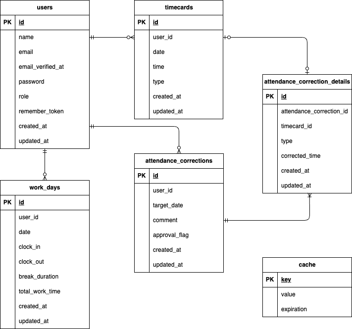

# time-attendance-management-app

## 環境構築

### Docker ビルド

1. git clone git@github.com:YamadaNanami/time-attendance-management-app.git
2. docker-compose up -d --build

### Laravel 環境構築

1. docker-compose exec php bash

2. composer install

3. composer create-project "laravel/laravel=12.\*" . --prefer-dist

4. config/app.php ファイルの'timezone'を修正する

5. php artisan tinker

6. echo Carbon\Carbon::now()

7. .env.example ファイルから.env ファイルを作成し、下記の環境変数を編集する（コメントアウトされている箇所はコメントアウトを解除する）

   - APP_LOCALE=ja
   - APP_FAKER_LOCALE=ja_JP
   - DB_CONNECTION=mysql
   - DB_HOST=mysql
   - DB_PORT=3306
   - DB_DATABASE=laravel_db
   - DB_USERNAME=laravel_user
   - DB_PASSWORD=laravel_pass
   - MAIL_MAILER=smtp
   - MAIL_HOST=mailhog
   - MAIL_PORT=1025

8. php artisan key:generate

9. php artisan migrate

10. php artisan db:seed

## テストの準備

1. テスト用 DB を作成する

   ```
   //テスト用データベースの作成
   docker-compose exec mysql bash
   mysql -u root -p
   //パスワードはrootと入力
   CREATE DATABASE demo_test;
   ```

2. config/database.php を開き、 mysql の配列部分をコピーして新たに mysql_test を作成し、以下の項目を修正する

   | 項目       | 変更前                        | 変更後      |
   | ---------- | ----------------------------- | ----------- |
   | 'database' | env('DB_DATABASE', 'laravel') | 'demo_test' |
   | 'username' | env('DB_USERNAME', 'root')    | 'root'      |
   | 'password' | env('DB_PASSWORD', '')        | 'root'      |

3. PHP コンテナにログインし、.env をコピーして.env.testing ファイルを作成する

   ```
   cp .env .env.testing
   ```

4. .env.testing ファイルの以下項目を編集する

   | 項目        | 変更前の値             | 変更後の値         |
   | ----------- | ---------------------- | ------------------ |
   | APP_ENV     | local                  | test               |
   | APP_KEY     | (キーが入っている状態) | （キーを削除する） |
   | DB_DATABASE | laravel_db             | demo_test          |
   | DB_USERNAME | laravel_user           | root               |
   | DB_PASSWORD | laravel_pass           | root               |

5. テスト用アプリケーションキーを作成する

   ```
   php artisan key:generate --env=testing
   ```

6. キャッシュを削除する

   ```
   php artisan config:clear
   ```

7. テスト用のテーブルを作成する

   ```
   php artisan migrate --env=testing
   ```

8. phpunit.xml 内の以下を編集する

   | env name        | 変更前の value | 変更後の value |
   | --------------- | -------------- | -------------- |
   | "DB_CONNECTION" | "sqlite"       | "mysql_test"   |
   | "DB_DATABASE"   | ":memory:"     | "demo_test"    |

## テストの実行

   ```
   docker compose exec php bash
   vendor/bin/phpunit tests/Feature/テストファイル名
   ```

## 使用技術（実行環境）

- PHP 8.4.2
- Laravel 12.0.8
- MySQL 8.0.26
- nginx 1.27.5

## ER 図



## URL

- 開発環境：http://localhost/
- phpMyAdmin：http://localhost:8080/
- MailHog：http://localhost:8025/
